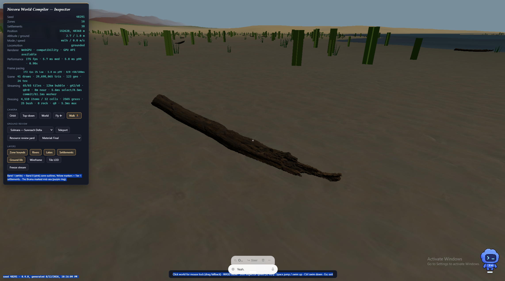

# Navora approved visual references

Date established: 2026-08-12  
Purpose: preserve explicit user art-direction decisions as durable production constraints.

## Dead tree trunk

Status: **approved visual reference**.

### Exact runtime identity

- Runtime dressing kind: `debris`
- Asset ID: `dead_tree_trunk`
- Runtime binding: `ASSET_BINDINGS.debris`
- Runtime target size: 3.2 m
- Shipping GLB: `packages/viewer-threejs/public/environment/dead_tree_trunk.glb`
- Shipping GLB SHA-256: `c63fec6b8ddc60164564b74506a8041d681c8cda755e2e85a7aeb59db9ffe2fd`
- Source: Poly Haven, `https://polyhaven.com/a/dead_tree_trunk`
- License: CC0
- Source file hashes and acquisition record: `packages/viewer-threejs/assets/environment/asset-lock.json`
- Approval screenshot world position: seed 48291, approximately X 152628 m / Z 48368 m, Solmara ground review
- Approval screenshot SHA-256: `6d764fffff8a98924e67443d94821f578e597e9f82956f954d0151b9c469d881`

### What is approved

- Irregular, non-procedural silhouette with believable taper and a naturally broken end.
- High-frequency bark/exposed-wood relief that remains coherent across the complete object.
- Dark recesses and roughness variation that describe real material depth without obvious tiling.
- Ground contact and horizontal deadfall presentation that reads as an object with mass.
- Strong close-range quality relative to surrounding presentation dressing.

This is approved as the retained hero deadfall/driftwood asset and as a **quality reference**, not as a universal tree component. Selected tree families may borrow its bark response, taper, asymmetry, and broken-branch language where biologically appropriate. Do not attach copies of the trunk mesh to every tree or homogenize all species around it.

## Rejected comparison: current grass and plant fallbacks

Status: **rejected for final ground-level quality**.

The tall green elements visible behind the approved trunk are primarily the runtime-authored `grassClump` geometry and crossed-plane reed/plant fallbacks in `environmentDressing.ts`. Their present state is useful only as placement, density, streaming, and wind scaffolding.

The following characteristics are explicitly rejected:

- wide rectangular/slab silhouettes;
- visibly flat crossed planes at walking distance;
- uniform height, width, vertical posture, and clustering;
- hard dark-green color blocks without leaf/blade-level material variation;
- a quality mismatch in which ground cover looks synthetic beside the scanned deadfall.

Replacement acceptance criteria:

- blades, stems, and leaves must have tapered silhouettes and species-appropriate curvature;
- near variants must avoid visible rectangular cards from ordinary walking angles;
- scale, lean, hue, age, density, and clump structure need deterministic variation;
- cards are permitted only when their alpha silhouettes, normals, clustering, and LOD transitions survive a 1–10 m ground review;
- performance must remain compatible with the existing deterministic cell/batch streaming system.

No final vegetation family should be approved solely from an aerial view. Compare it at walking height beside the approved dead-tree-trunk reference before world scattering is enabled.
